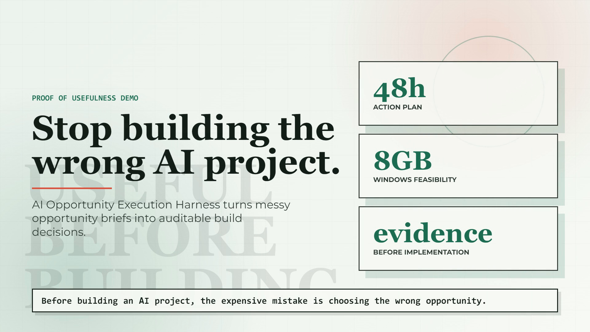
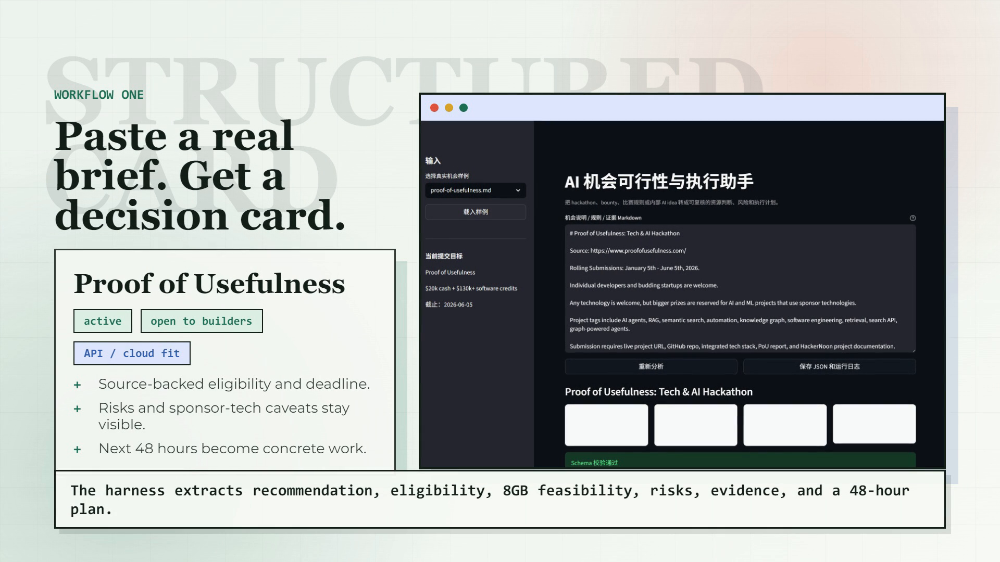
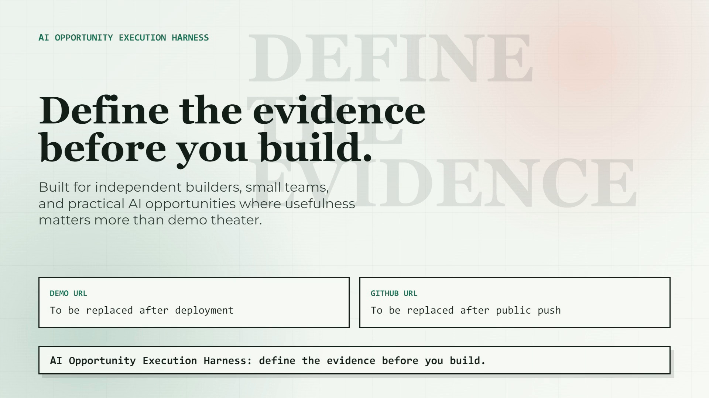

# HyperFrames 演示视频流程

## 当前产物

- HyperFrames 工程：`competitions/20-active/proof-of-usefulness-agent-harness/video/pou-demo-video/`
- Studio 预览：`http://localhost:3017/#project/pou-demo-video`
- 标准质量 MP4：`competitions/20-active/proof-of-usefulness-agent-harness/video/pou-demo-video/renders/pou-demo-video.mp4`
- 英文旁白音频：`competitions/20-active/proof-of-usefulness-agent-harness/video/pou-demo-video/assets/narration.wav`

## 语言与部署决策

Proof of Usefulness 和 HackerNoon 的比赛页、提交页、评审语境以英文为主，所以演示视频使用英文旁白和英文字幕。

提交页第 1 步要求 `Project Homepage URL`，官方说明还要求 live project URL、GitHub repo 和 integrated tech stack。因此 demo 部署目标不是本地视频页面，而是公开可访问的产品主页或在线 Streamlit demo。推荐顺序：

1. 公开 GitHub 仓库。
2. Streamlit Community Cloud 或 Hugging Face Spaces 部署在线 demo。
3. 把部署 URL 填入视频 CTA、提交草稿和 Proof of Usefulness 表单。

## 执行步骤

1. 安装 HyperFrames skills：

   ```powershell
   npx skills add heygen-com/hyperframes
   ```

2. 检查本机渲染环境：

   ```powershell
   npx hyperframes doctor
   ```

3. 补齐缺失依赖。本机曾缺 Chrome、FFmpeg 和 TTS Python 包：

   ```powershell
   npx hyperframes browser ensure
   winget install --id Gyan.FFmpeg -e --accept-package-agreements --accept-source-agreements --silent
   pip install kokoro-onnx soundfile
   ```

4. 创建视频工程：

   ```powershell
   npx hyperframes init .\competitions\20-active\proof-of-usefulness-agent-harness\video\pou-demo-video --example blank --non-interactive
   ```

5. 复制产品截图到视频 assets：

   ```powershell
   Copy-Item .\competitions\20-active\proof-of-usefulness-agent-harness\app\docs\screenshots\01-proof-of-usefulness-analysis.png .\competitions\20-active\proof-of-usefulness-agent-harness\video\pou-demo-video\assets\proof-analysis.png
   Copy-Item .\competitions\20-active\proof-of-usefulness-agent-harness\app\docs\screenshots\02-save-run-log.png .\competitions\20-active\proof-of-usefulness-agent-harness\video\pou-demo-video\assets\save-run-log.png
   ```

6. 写入 `DESIGN.md`、`SCRIPT.md`、`STORYBOARD.md` 和 `index.html`。

7. 生成英文旁白：

   ```powershell
   npx hyperframes tts .\assets\narration.txt --voice af_nova --output .\assets\narration.wav
   ```

8. 检查 composition：

   ```powershell
   npm run check
   ```

   当前结果：lint 无错误，validate 无控制台错误且 52 个文本元素通过 WCAG AA，inspect 无布局问题。仅保留一个维护性警告：`index.html` 文件较大，后续可拆成 sub-compositions。

9. 渲染 MP4：

   ```powershell
   npx hyperframes render --output .\renders\pou-demo-video.mp4 --quality standard
   ```

10. 抽帧复核：

    ```powershell
    ffmpeg -ss 70 -i .\renders\pou-demo-video.mp4 -frames:v 1 .\renders\thumbs\t70.png
    ```

## 抽帧记录







## 原理说明

HyperFrames 把 HTML 当作视频源文件。`index.html` 中的 `data-composition-id` 定义一个 composition，`data-start`、`data-duration` 和 `data-track-index` 定义剪辑在时间轴上的位置。GSAP timeline 负责可复现动画，必须注册到 `window.__timelines["main"]`，这样预览器和渲染器都能按时间精确 seek。

本视频用了 7 个 scene，每个 scene 是一个 timed clip。场景切换通过重叠时间窗、blur reveal 和内部元素入场动画完成。截图不是 iframe，而是静态 PNG assets，因为渲染器需要可 seek、可复现的画面。

旁白用 HyperFrames 的本地 TTS 生成，文件放入 `assets/narration.wav`，再作为 `<audio>` 轨道加入 composition。最终 MP4 由 HyperFrames 调用 Chrome 捕获帧，再交给 FFmpeg 编码。

质量控制分三层：

- `lint`：检查 composition 结构、时间线和常见错误。
- `validate`：检查控制台错误与文字对比度。
- `inspect`：抽样检查文字和元素是否溢出画布。

这条流程的价值是可复现：脚本、设计、分镜、截图、旁白和渲染命令都在仓库里，后续替换 demo URL 或 GitHub URL 后可以重新渲染同一支视频。
