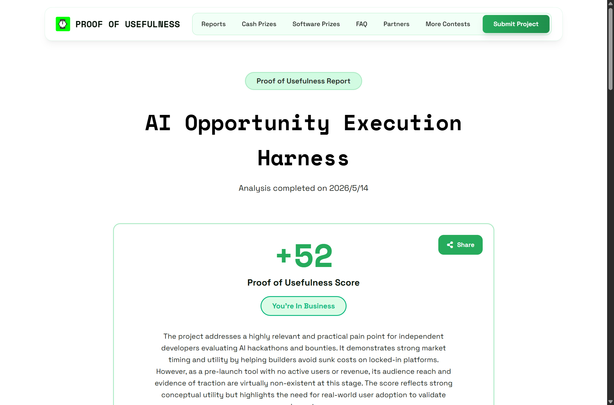
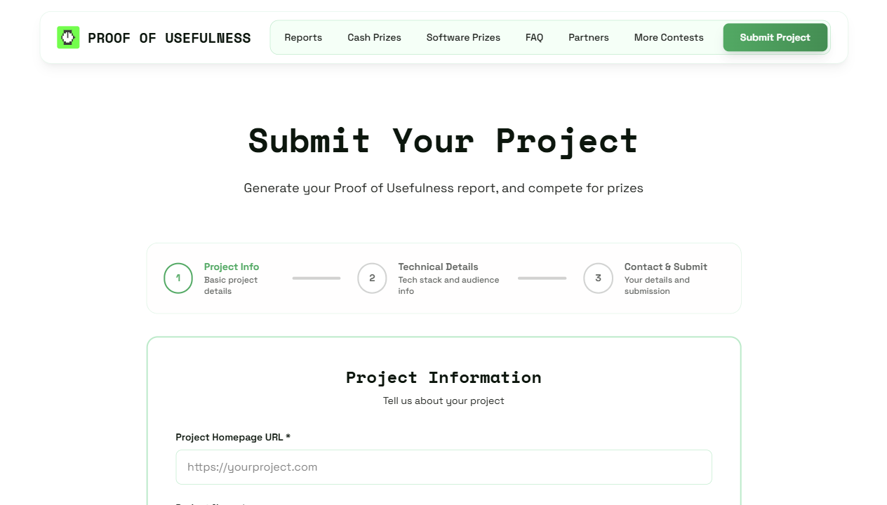
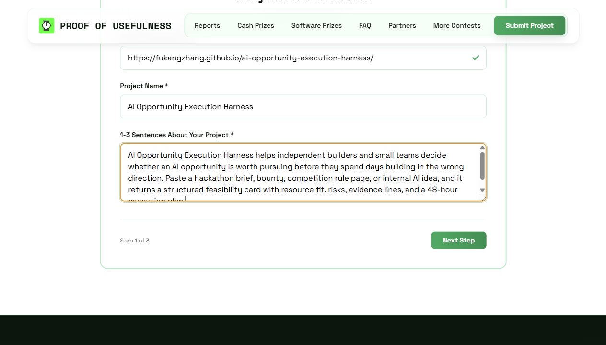
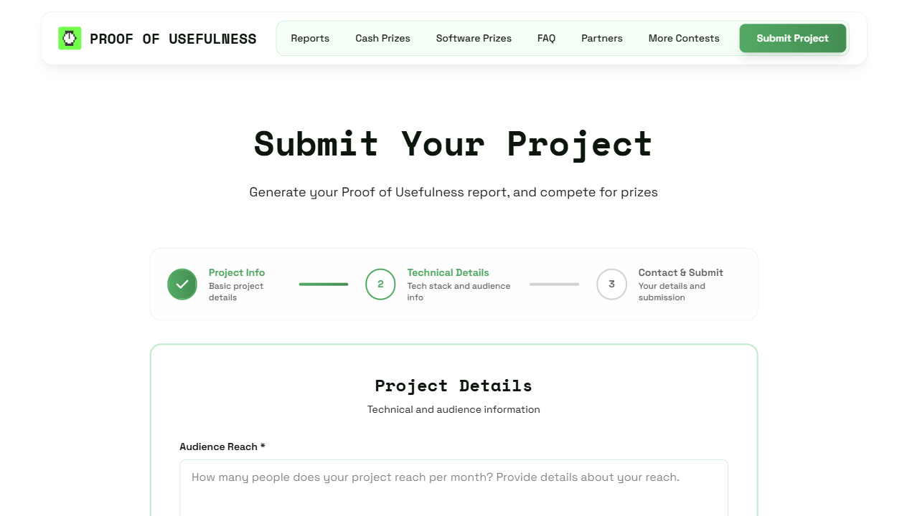
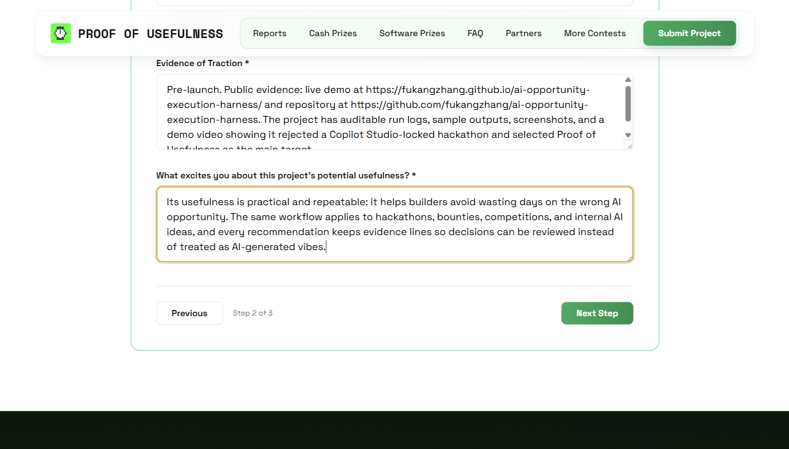
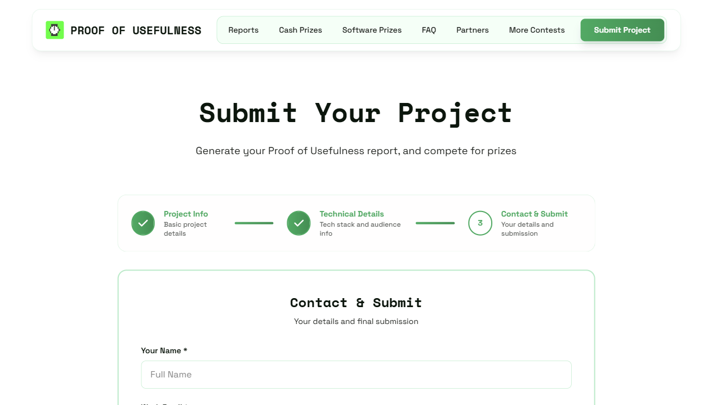

# Proof of Usefulness 提交与排名说明

更新时间：2026-05-14  
官方入口：

- 比赛首页：https://www.proofofusefulness.com/
- 提交页：https://www.proofofusefulness.com/submit
- Reports：https://www.proofofusefulness.com/reports
- Cash Prizes：https://www.proofofusefulness.com/cash-prizes
- FAQ：https://www.proofofusefulness.com/faq

## 最终提交结果

提交状态：已完成。  
Report URL：https://www.proofofusefulness.com/reports/ai-opportunity-execution-harness  
PoU Score：52  
分数档位：You're In Business  
报告生成日期：2026-05-14

截图：  


官方报告给出的核心结论：项目解决了独立开发者评估 AI hackathon 和 bounty 的真实痛点，市场时机与概念效用较强；当前主要短板是 pre-launch 状态，没有真实用户、收入或第三方牵引证据。

## 这个比赛是什么

Proof of Usefulness 是 HackerNoon 的技术与 AI hackathon。核心不是刷一个模型分数，而是证明项目真的有用：是否解决真实问题、是否有人使用、是否有公开证据、技术实现是否完整。

官方比赛页记录的信息：

- 滚动提交时间：2026-01-05 到 2026-06-05。
- 奖励：$20k cash prizes，加上 $130k+ software credits，总奖池口径为 $150k+。
- 月度开奖，最终奖项在 2026-06 到 2026-07。
- 任意技术栈都可以参赛，但 AI/ML 项目和使用 sponsor technologies 的项目更容易匹配更大类目的奖励。

## 排名怎么看

这个比赛更像“提交项目 -> 生成 PoU Report -> 得到 PoU Score -> 进入 Reports/评奖池”，不是 Kaggle 那种只看一个 leaderboard 文件提交分数的比赛。

官方首页说明：提交项目后会生成 Proof of Usefulness Report，并获得 PoU Score。Reports 页面用于查看项目报告和分数。

分数机制按官方说明大致如下：

| 维度 | 权重 | 我们当前策略 |
|---|---:|---|
| Real-World Utility | 25% | 明确解决“AI 机会是否值得做”的真实决策问题。 |
| Evidence of Traction | 25% | 目前是 pre-launch，所以如实提供 GitHub Pages、公开仓库、运行日志、截图和视频。 |
| Audience Reach & Impact | 20% | 当前如实填写 early/public demo reach，后续靠 HackerNoon 文章和真实使用提升。 |
| Technical Innovation | 15% | 强调结构化 feasibility card、证据行、8GB Windows 约束和 48 小时执行计划。 |
| Market Timing & Relevance | 10% | AI agent/RAG/hackathon/内部 AI idea 决策是当前强需求。 |
| Functional Completeness | 5% | 已有可运行 live demo、样例、JSON、日志、视频和文档。 |

官方分数区间从 Lab Mode 到 Unicorn Utility。我们当前是新项目，真实预期不应该假装有大量用户；第一阶段目标是先拿到 report 和 baseline score，然后通过公开文章、更多真实样例和使用证据继续提升。

## 本项目提交定位

项目名：

```text
AI Opportunity Execution Harness
```

Project Homepage URL：

```text
https://fukangzhang.github.io/ai-opportunity-execution-harness/
```

GitHub Repository：

```text
https://github.com/fukangzhang/ai-opportunity-execution-harness
```

一句话理解：这是一个帮助独立开发者、小团队、hackathon 参赛者判断 AI 机会是否值得投入的浏览器工具。它把比赛页、bounty、rule page 或内部 AI idea 转成结构化可行性卡片，给出资源匹配、风险、证据行和 48 小时执行计划。

## 已填写内容

### Step 1: Project Info

截图：  
  


填写内容：

```text
Project Homepage URL:
https://fukangzhang.github.io/ai-opportunity-execution-harness/

Project Name:
AI Opportunity Execution Harness

1-3 Sentences About Your Project:
AI Opportunity Execution Harness helps independent builders and small teams decide whether an AI opportunity is worth pursuing before they spend days building in the wrong direction. Paste a hackathon brief, bounty, competition rule page, or internal AI idea, and it returns a structured feasibility card with resource fit, risks, evidence lines, and a 48-hour execution plan.
```

注意：页面要求 1-3 句。这里使用 2 句，避免过长导致表单状态异常。

### Step 2: Technical Details

截图：  
  


填写内容：

```text
Audience Reach:
Pre-launch public demo. Current reach is repository and project-page based: the live GitHub Pages demo and public GitHub repository are available for judges, builders, and HackerNoon readers. Expected early audience is independent AI builders, hackathon participants, and small teams evaluating AI opportunities before committing build time.

Who's It For:
Independent developers, small startup teams, hackathon participants, and internal innovation teams who need to decide whether an AI opportunity is worth building. They gain value by seeing eligibility, platform lock-in risk, 8GB Windows feasibility, evidence lines, and a 48-hour execution plan before spending days on the wrong project.

Technologies Used:
Other / Custom Stack

Additional technologies:
GitHub Pages, vanilla JavaScript, HTML/CSS, Python, Streamlit, JSON Schema, GitHub Actions, HyperFrames, FFmpeg.

Evidence of Traction:
Pre-launch. Public evidence: live demo at https://fukangzhang.github.io/ai-opportunity-execution-harness/ and repository at https://github.com/fukangzhang/ai-opportunity-execution-harness. The project has auditable run logs, sample outputs, screenshots, and a demo video showing it rejected a Copilot Studio-locked hackathon and selected Proof of Usefulness as the main target.

What excites you about this project's potential usefulness?
Its usefulness is practical and repeatable: it helps builders avoid wasting days on the wrong AI opportunity. The same workflow applies to hackathons, bounties, competitions, and internal AI ideas, and every recommendation keeps evidence lines so decisions can be reviewed instead of treated as AI-generated vibes.
```

重要判断：没有勾选 Bright Data、Storyblok、Neo4j、Algolia，因为当前版本没有实际集成这些 sponsor technologies。为了避免提交材料不真实，本次只勾选 Other / Custom Stack。

### Step 3: Contact & Submit

截图：  


最终处理：

```text
Your Name:
用户确认后填写

Work Email:
用户确认后填写，文档中不公开记录完整邮箱

Referral Code:
留空

I agree to receive Proof of Usefulness updates:
最终保留勾选，因为官方前端校验要求勾选后才能提交
```

补充发现：官方前端代码实际要求先发送并验证邮箱验证码，且必须同意接收 Proof of Usefulness updates 后才能提交。最初以为订阅是可取消的普通营销选项，但前端校验写明不勾选会阻止提交。

提交完成后生成了报告：

```text
https://www.proofofusefulness.com/reports/ai-opportunity-execution-harness
```

## 为什么刚才 Next 点不了

出现过两种原因：

1. 第 1 步的必填字段被清空，所以按钮保持 disabled。
2. 第 2 步必须至少选择一个 technology，未选择时按钮也保持 disabled。

处理方式：

1. 重新填写 Project Homepage URL、Project Name、项目简介。
2. 在 Technologies Used 中选择 `Other / Custom Stack`。
3. 保存每一步截图，便于后续复盘。

## 提交后要做什么

1. 写 HackerNoon 风格项目文章，带 `#proof-of-usefulness` 和相关技术标签。
2. 把 live demo、GitHub repo、demo video 和本报告串成公开发布材料。
3. 找 3-5 个真实用户试用，让他们给出一句反馈或 issue。
4. 在 README / site 中增加“已有报告分数”和改进路线。
5. 后续如果有 GitHub stars、用户反馈、文章发布、更多真实样例，再更新报告，提高 audience reach 和 evidence of traction。

## 提分重点

当前分数低的主要原因不是产品方向错，而是证据太少：

| 报告维度 | 当前结果 | 下一步 |
|---|---:|---|
| Real World Utility | 20.0 | 保持，继续明确真实决策场景。 |
| Audience Reach Impact | 2.0 | 发 HackerNoon 文章、README、社交渠道，积累访问和使用证据。 |
| Technical Innovation | 9.0 | 增加 LLM 抽取模式和更多真实样例。 |
| Evidence Of Traction | 1.25 | 收集 GitHub stars、issue、用户反馈、demo 使用记录。 |
| Market Timing Relevance | 8.5 | 保持 AI agent / RAG / hackathon 决策定位。 |
| Functional Completeness | 6.75 | 增加测试、README、公开教程和更新路径。 |
