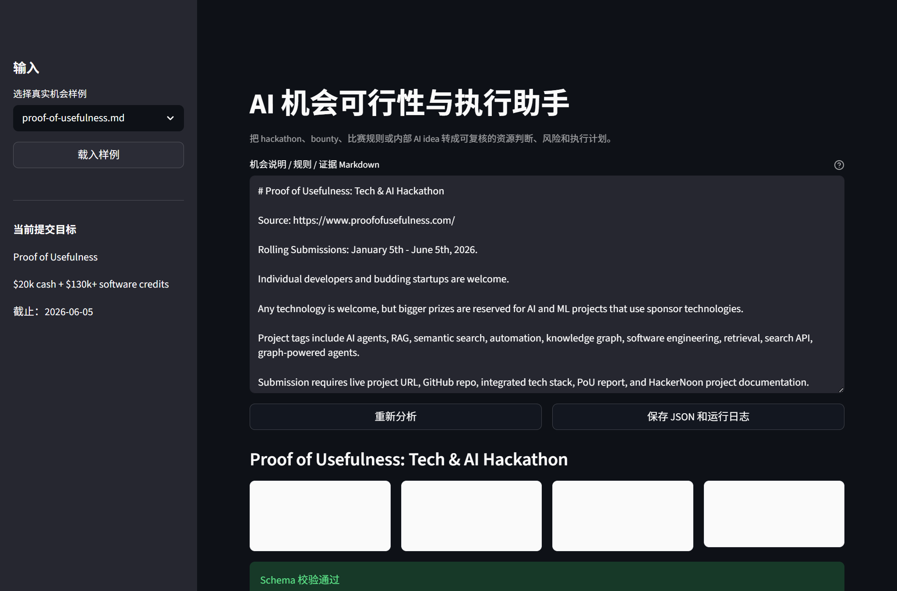
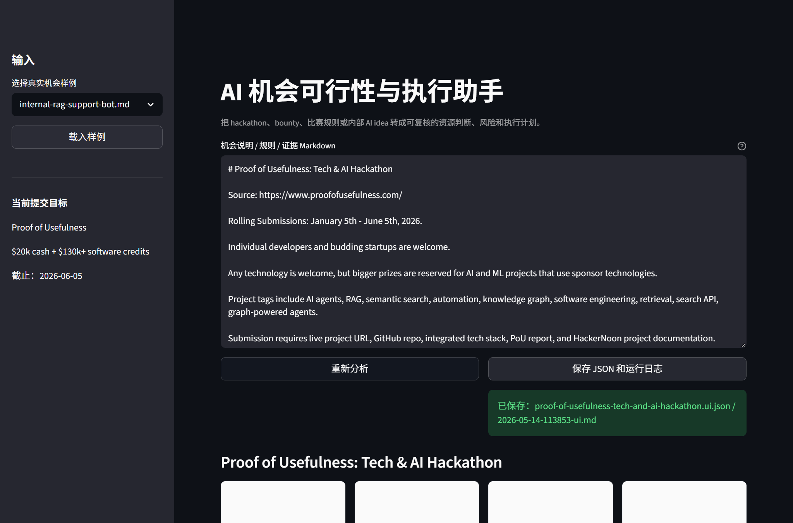

# AI 机会可行性与执行助手：操作流程与原理

## 这个产品做什么

它把一个 AI 机会转成可执行判断。这里的“机会”可以是 hackathon、bounty、比赛、内部 AI idea 或客户需求。

输入是一段 Markdown：来源、时间窗口、用户/资格、提交物、本地资源约束。输出是一张结构化卡片：是否值得推进、8GB Windows 是否可行、风险在哪里、证据来自哪一行、接下来 48 小时怎么做。

## 本地运行

在项目根目录运行：

```powershell
python -m pip install -r .\competitions\20-active\proof-of-usefulness-agent-harness\app\requirements.txt
python -m streamlit run .\competitions\20-active\proof-of-usefulness-agent-harness\app\streamlit_app.py --server.port 8502 --server.address 127.0.0.1
```

打开：

```text
http://127.0.0.1:8502
```

## 公开部署

公开提交优先使用 GitHub Pages 静态 live demo，不需要额外服务器或域名。完整流程见：

- [GITHUB_PAGES_DEPLOYMENT.md](GITHUB_PAGES_DEPLOYMENT.md)

## 使用流程

1. 在左侧选择一个样例，例如 `proof-of-usefulness.md`。
2. 点击“载入样例”，或直接在文本框粘贴自己的 AI 机会说明。
3. 查看系统生成的建议、资格/准入、8GB 可行性和时间窗口。
4. 检查“风险与人工复核点”，不要把自动判断直接当最终事实。
5. 查看“证据片段”，确认关键判断能追溯到输入行号。
6. 点击“保存 JSON 和运行日志”，把本次分析保存为 Proof of Usefulness 证据。

## 截图

主分析界面：



保存运行日志：



## 演示视频

- 脚本与分镜见 [DEMO_VIDEO_SCRIPT.md](DEMO_VIDEO_SCRIPT.md)。
- 录制清单见 [RECORDING_CHECKLIST.md](RECORDING_CHECKLIST.md)。
- HyperFrames 生成流程见 [HYPERFRAMES_DEMO_VIDEO_WORKFLOW.md](HYPERFRAMES_DEMO_VIDEO_WORKFLOW.md)。

## 输出解释

- `recommendation`：是否推进。`active` 是主线推进，`reference` 是仅参考，`rejected` 是排除。
- `eligibility`：参赛或准入状态。当前沿用比赛库枚举：开放参赛、企业/组织限定、邀请制、未知。
- `fit_8gb`：8GB Windows 可行性。A 是本地可做，B 是本地工程加 API/云端，C 是平台 Notebook，D 是不建议主攻。
- `risks`：需要人工复核的风险，例如 sponsor technology 绑定、低代码生态锁定、公开 URL/GitHub 缺失。
- `evidence`：证据行号，用于说明判断来自输入文本的哪一行。

## 原理说明

第一版用规则启发式实现，故意保持简单可解释。

1. `streamlit_app.py` 负责界面：选择样例、粘贴 Markdown、展示卡片、保存日志。
2. `src/harness.py` 负责抽取和判断：读取标题、来源、时间窗口、资格、8GB 可行性、建议和风险。
3. `schema/competition-card.schema.json` 负责结构约束：保证输出字段完整，枚举值不会随意漂移。
4. `samples/` 负责回归样例：每次改逻辑都可以重新跑这些样例，确认判断没有退化。
5. `run-logs/` 和 `out/` 负责证据留存：保存每次输入、输出和 JSON，服务 Proof of Usefulness 的“可验证有用性”要求。

下一版会把关键词启发式升级为 LLM 抽取，但仍保留 schema 校验和人工复核点。核心原则不变：先有证据，再开始构建。
